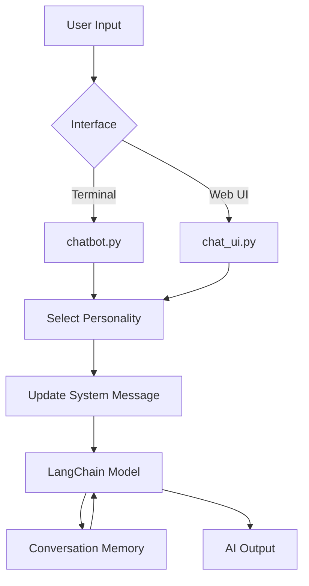

# AI Experiments Project

This project contains various scripts to experiment with Large Language Models and embeddings using LangChain.

## Completed Modules

* **01_chat.py**: Basic interactive chat loop using a single model.
* **02_parameters.py**: Demonstrates how temperature and max_tokens affect model generation.
* **03_compare_models.py**: Sends a single prompt to multiple models to compare their outputs.
* **04_model_explorer.py**: Reads available models from a CSV and allows interactive selection.
* **05_embeddings.py**: Converts text into vector embeddings and displays the numerical output.
* **chatbot.py**: A terminal-based chatbot with conversation memory and dynamic personality switching.
* **chat_ui.py**: A Streamlit-based web interface for the chatbot with dynamic personality selection.

## Flowchart

The following flowchart explains the general architecture of the interactive chat applications in this project.



## Local Deployment

Follow these steps to run the project on your local system.

### Prerequisites

1. Install Python.
2. Configure your API keys in the `.env` file.

### Installation

Install the required dependencies using the provided requirements file:

```bash
pip install -r requirements.txt
```

### Execution

To run standard Python scripts:

```bash
python experiments/chatbot.py
```

To run the Streamlit web interface:

```bash
streamlit run experiments/chat_ui.py
```
